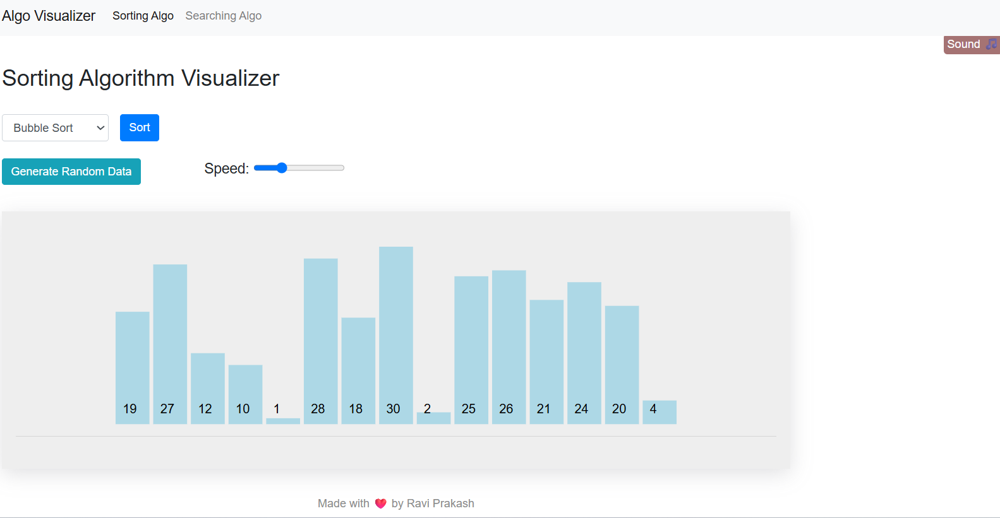
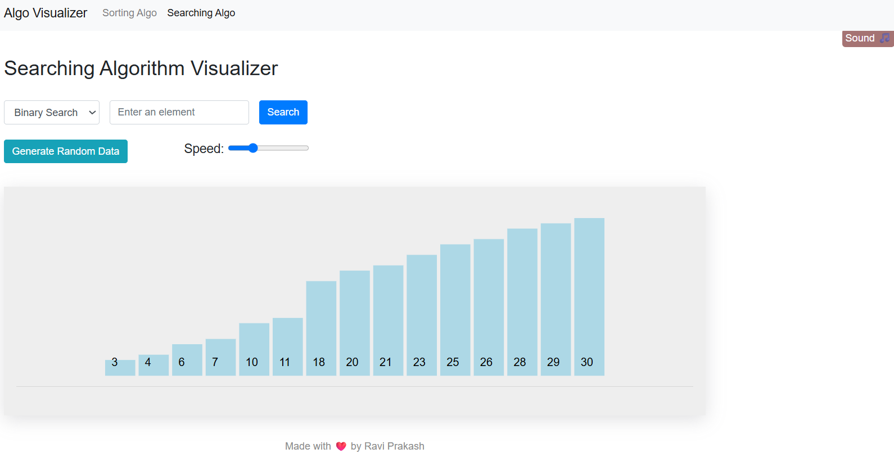

# 🔍 Sorting & Searching Algorithm Visualizer

An interactive web-based visualization tool that demonstrates how popular sorting and searching algorithms work through real-time animations. The project helps students and beginners understand algorithm behavior, comparisons, swaps, and search operations in a visual and intuitive manner.

## 🚀 Live Demo

**Live:** [https://sorting-searching-alogorithm-visual-sandy.vercel.app/]

**GitHub:** [https://github.com/ravisingh123123/Sorting-searching-Algorithm-Visualizer.git]

---

## ✨ Features

### Sorting Algorithms

* Bubble Sort
* Selection Sort
* Insertion Sort
* Merge Sort

### Searching Algorithms

* Linear Search
* Binary Search

### Interactive Controls

* Generate random datasets
* Adjustable animation speed
* Start and stop execution
* Visual representation of comparisons and swaps
* Sound effects for enhanced interaction
* Responsive user interface

---

## 🛠️ Tech Stack

* HTML5
* CSS3
* JavaScript (ES6)
* D3.js
* Bootstrap 4
* Git
* Vercel

---

## 📂 Project Structure

```text
Sorting-Searching-Algorithm-Visualizer/
│
├── index.html
├── style.css
├── base.js
├── function.js
│
├── searching-algorithm/
│   ├── index.html
│   ├── style.css
│   ├── base.js
│   └── function.js
│
├── sound-effects/
│   ├── complete.mp3
│   ├── swipe.mp3
│   └── swoosh.mp3
│
└── README.md
```

---

## ⚙️ Installation

### Clone the Repository

```bash
git clone <https://github.com/ravisingh123123/Sorting-searching-Algorithm-Visualizer>
```

### Navigate to Project Directory

```bash
cd Sorting-Searching-Algorithm-Visualizer
```

### Run the Project

Open `index.html` in your browser.

---

## 🎯 Learning Objectives

This project helps users understand:

* Time complexity of sorting algorithms
* Search operation flow
* Data movement during sorting
* Algorithm comparisons through visualization
* Fundamental Data Structures & Algorithms concepts

---

## 📸 Screenshots

### Sorting Visualization


### Searching Visualization


---

## 🌟 Future Improvements

* Quick Sort Visualization
* Heap Sort Visualization
* DFS & BFS Visualization
* Complexity Comparison Dashboard
* Dark Mode
* Custom Array Input
* Pause & Resume Functionality

---

## 👨‍💻 Author

**Ravi Solanki**

B.Tech, Electronics & Communication Engineering
Maulana Azad National Institute of Technology (MANIT), Bhopal

GitHub: https://github.com/ravisingh123123

---

## ⭐ Support

If you found this project useful, consider giving it a star on GitHub.
